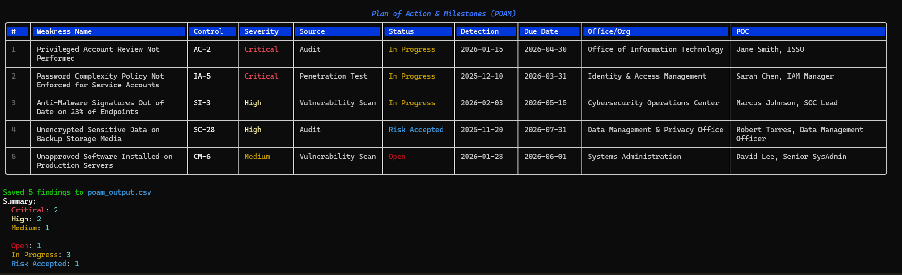
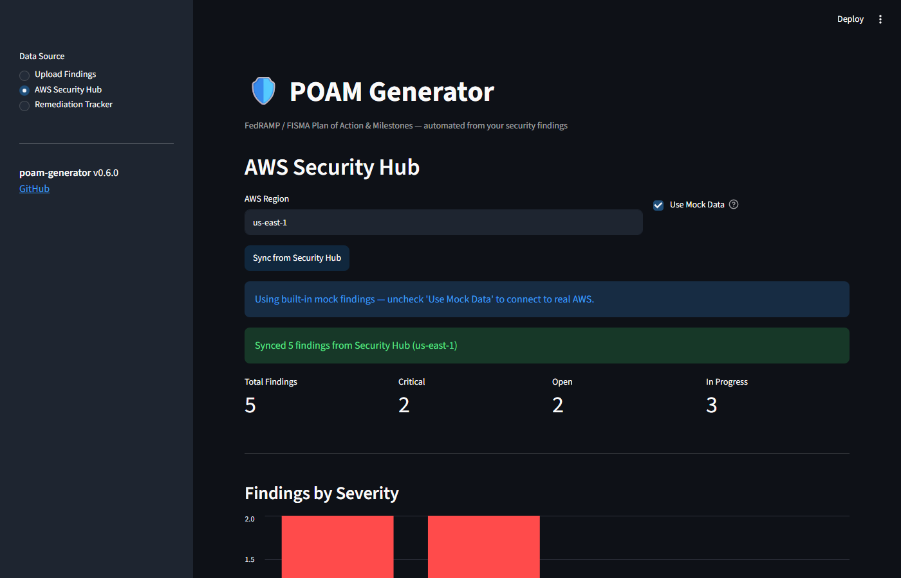

# POAM Generator

A CLI tool for generating FedRAMP/FISMA **Plan of Action & Milestones (POAM)** documents from structured JSON findings.

🔗 **[Live Demo](https://poam-generator-cappnr854zntygjkdtqxzbs.streamlit.app)** | **[GitHub](https://github.com/JulietRodriguez/poam-generator)**

## Features

- **Color-coded terminal table** — findings sorted by severity (Critical → Low) with rich formatting
- **Multiple output formats** — CSV, Excel (`.xlsx`), OSCAL JSON, and OSCAL XML
- **Built-in validation** — checks required fields and valid values before generating output
- **Demo mode** — 5 realistic sample findings spanning AC-2, IA-5, SI-3, SC-28, and CM-6 controls
- **Summary report** — per-severity and per-status counts printed after every run
- **NIST 800-53 / FedRAMP aligned** — fields match standard POAM column requirements

## Screenshots

### CLI Demo



### Web Dashboard



## Installation

```bash
git clone https://github.com/JulietRodriguez/poam-generator.git
cd poam-generator
pip install -e .
```

## Usage

### Run the built-in demo

```bash
poam demo
```

Displays 5 sample findings and saves `poam_output.csv` in the current directory.

### Generate a POAM from your findings

```bash
# CSV (default)
poam generate -i findings.json -o poam.csv

# Excel
poam generate -i findings.json -o poam.xlsx --format excel

# OSCAL JSON
poam generate -i findings.json -o poam.json --format oscal

# OSCAL XML
poam generate -i findings.json -o poam.xml --format oscal-xml
```

### Validate a findings file

```bash
poam validate -i findings.json
```

### Findings JSON format

```json
[
  {
    "weakness_name": "Privileged Account Review Not Performed",
    "weakness_description": "...",
    "security_control": "AC-2",
    "severity": "Critical",
    "source": "Audit",
    "detection_date": "2026-01-15",
    "scheduled_completion": "2026-04-30",
    "office_org": "Office of Information Technology",
    "point_of_contact": "Jane Smith, ISSO",
    "resources_required": "IAM team (40 hrs)",
    "remediation_plan": "...",
    "milestones": ["2026-02-01: Disable stale accounts"],
    "status": "In Progress",
    "comments": "..."
  }
]
```

Valid severities: `Critical`, `High`, `Medium`, `Low`  
Valid statuses: `Open`, `In Progress`, `Closed`, `Risk Accepted`

## Remediation Tracking

Load findings into the local SQLite tracker and monitor remediation progress:

```bash
# Import findings into the tracker
poam track -i findings.json

# Show overdue, due-this-week, and all open findings
poam status

# Update a finding's status with notes
poam status --update POAM-001 --set-status "In Progress" --notes "Patch applied"
```

The tracker stores all status changes with timestamps so you have a full audit trail.

## Web Dashboard

Launch a browser-based dashboard to upload findings, view color-coded POAM tables, and download outputs:

```bash
poam dashboard
```

Opens at `http://localhost:8501` and loads straight to a live view of findings from AWS Security Hub with no setup required. Features:

- **AWS Security Hub** — opens automatically with findings loaded, no clicks needed. Connect real AWS credentials to sync live findings
- **Upload Findings** — drag-and-drop a JSON findings file for offline use
- **Remediation Tracker** — timeline of findings by due date (🔴 overdue, 🟡 due this week, 🟢 on track), inline status update form, full status change history
- **Metrics panel** — total findings, critical count, open count, in-progress count
- **Severity bar chart** — visual breakdown of findings by risk level

## AWS Security Hub Integration

Pull live findings directly from AWS Security Hub and automatically map them to a POAM-ready JSON file.

### Test with mock data (no AWS credentials needed)

```bash
poam sync --source aws-security-hub --region us-east-1 --mock
```

### Sync real findings from your AWS account

```bash
poam sync --source aws-security-hub --region us-east-1 --output findings.json
```

Then generate your POAM from the synced findings:

```bash
poam generate -i findings.json -o poam.xlsx --format excel
```

AWS credentials must be configured via `aws configure` or environment variables (`AWS_ACCESS_KEY_ID`, `AWS_SECRET_ACCESS_KEY`, `AWS_DEFAULT_REGION`).

The sync command pulls findings filtered to `RecordState=ACTIVE` and `WorkflowStatus=NEW or NOTIFIED`, and maps Security Hub fields to all standard POAM columns automatically.

## Requirements

- Python 3.10+
- `click >= 8.1`
- `rich >= 13.0`
- `openpyxl >= 3.1`
- `boto3 >= 1.26` (for AWS Security Hub integration)

## Contributing

Pull requests welcome. For major changes open an issue first to discuss what you'd like to change.

## License

MIT — open source, free to use and modify.
